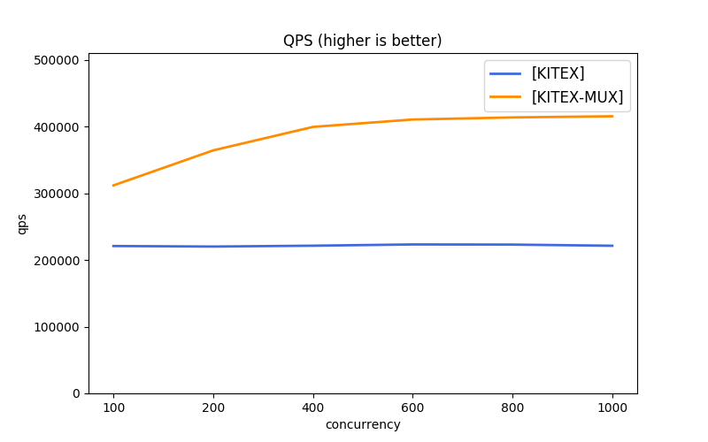
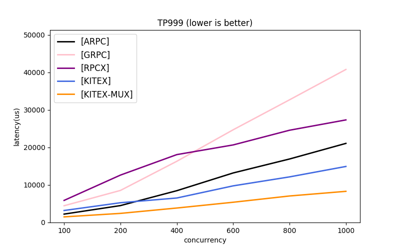

# kitex-benchmark

本项目展示了 [kitex][kitex] 的几种简单用法, 并提供了若干对比项目。

由于不同框架使用的 协议、传输模式等 存在差异，不能强行拉齐。[kitex][kitex] 给出了几种简单的组合，可供参考。

1. [kitex][kitex]:
    1. 多协议：[thrift][thrift] (推荐)、[protobuf][protobuf]
    2. 多传输模式：长连接池(推荐)、连接多路复用(mux)
2. 对比项目:
    1. [thrift][thrift] 方向，暂时没有找到较为流行的对比框架，后续可以添加。
    2. [protobuf][protobuf] 方向，提供了 [grpc][grpc]、[rpcx][rpcx] 作为对比项目(均使用连接多路复用)。
   
## 使用说明

### 快速执行：loopback 模式

执行前请先确认满足[环境要求](#环境要求)。

#### Thrift

```bash
./scripts/benchmark_thrift.sh
```

#### Protobuf

```bash
./scripts/benchmark_pb.sh
```

### 跨机器执行

loopback 模式数据并未真正进入网卡，未能真实模拟线上服务情况。所以也提供了 Client 与 Server 分别部署执行的方式。

但是需要注意的是，如果执行机器上拥有超过 taskset 设置的核心，网络包会通过 softirq 借道其他未被 taskset 控制的 ksoftirqd 内核线程，进而享受了其他 CPU 的计算。所以需要严格的压测数据时，推荐使用和 taskset 一致的机器配置，或是删除 taskset。

#### Thrift

```bash

./scripts/run_thrift_servers.sh

./scripts/run_thrift_servers.sh
```

#### Protobuf

```bash
./scripts/benchmark_pb.sh
```

### Profiling

由于默认压测参数会比较迅速完成一次压测，为了获得更长采集时间，可以手动在 `./scripts/env.sh` 中调整压测参数 n 大小。

#### Profiling Client

```bash
go tool pprof localhost:18888/debug/pprof/{pprof_type}
```

#### Profiling Server

不同 server 的 port 映射参见相应脚本，如:

```bash
cat ./scripts/benchmark_pb.sh

# ...
repo=("grpc" "kitex" "kitex-mux" "rpcx" "arpc" "arpc-nbio")
ports=(8000 8001 8002 8003 8004 8005)
```

获取到对应 server 端口号后，执行：

```bash
go tool pprof localhost:{port}/debug/pprof/{pprof_type}
```

### 更多场景测试

修改 `./scripts/env.sh` 文件：

```bash
# 发送压测请求数
n=5000000
# 请求体大小
body=(1024 5120)
# 并发度
concurrent=(100 200 400 600 800 1000)
# server handler sleep 时间(/ms)，默认为 0
sleep=0
```

## 环境要求

OS: Linux
   * 默认依赖了命令 `taskset`, 限定 client 和 server 运行的 CPU; 如在其他系统执行, 请修改脚本。

CPU: 推荐配置 >=20核, 最低要求 >=4核
   * 压测脚本默认需要 20核 CPU, 具体在脚本的 `taskset -c ...` 部分, 可以修改或删除。

## 参考数据

相关说明: 

该压测数据是在调用端有充分机器资源压满服务端的情况下测试，更侧重于关注服务端性能。后续会提供调用端性能数据情况。

### 配置

* CPU:    Intel(R) Xeon(R) Gold 5118 CPU @ 2.30GHz
  * 运行限定 server 4CPU, client 16CPU
* OS:     Debian 5.4.56.bsk.1-amd64 x86_64 GNU/Linux
* Go:     1.15.4

### 数据 (echo size 1KB)

<table>
   <tr><th> 并发数 </th><th> thrift </th><th> 传输 </th><th> TPS </th><th> TP99(ms) </th><th> TP999(ms) </th></tr>
   <tr><td colspan="6"></td></tr>

   <tr><td rowspan="3"> 100 </td></tr>
   <tr><td> kitex </td><td> 长连接池    </td><td> 249586.69 </td><td> 1.39ms </td><td> 9.23ms </td></tr>
   <tr><td> kitex </td><td> 连接多路复用 </td><td> 223230.54 </td><td> 1.46ms </td><td> 2.46ms </td></tr>
   <tr><td colspan="6"></td></tr>

   <tr><td rowspan="3"> 200 </td></tr>
   <tr><td> kitex </td><td> 长连接池    </td><td> 251653.10 </td><td> 3.23ms </td><td> 11.56ms </td></tr>
   <tr><td> kitex </td><td> 连接多路复用 </td><td> 259954.09 </td><td> 2.48ms </td><td> 4.23ms </td></tr>
   <tr><td colspan="6"></td></tr>

   <tr><td rowspan="3"> 400 </td></tr>
   <tr><td> kitex </td><td> 长连接池    </td><td> 251758.62 </td><td> 8.05ms </td><td> 13.76ms </td></tr>
   <tr><td> kitex </td><td> 连接多路复用 </td><td> 284189.41 </td><td> 4.31ms </td><td> 7.57ms </td></tr>
   <tr><td colspan="6"></td></tr>

   <tr><td rowspan="3"> 600 </td></tr>
   <tr><td> kitex </td><td> 长连接池    </td><td> 252804.29 </td><td> 8.79ms </td><td> 14.17ms </td></tr>
   <tr><td> kitex </td><td> 连接多路复用 </td><td> 293386.70 </td><td> 5.97ms </td><td> 10.13ms </td></tr>

   <tr><td rowspan="3"> 800 </td></tr>
   <tr><td> kitex </td><td> 长连接池    </td><td> 249029.06 </td><td> 10.69ms </td><td> 14.75ms </td></tr>
   <tr><td> kitex </td><td> 连接多路复用 </td><td> 301462.58 </td><td> 7.91ms </td><td> 13.99ms </td></tr>

   <tr><td rowspan="3"> 1000 </td></tr>
   <tr><td> kitex </td><td> 长连接池    </td><td> 243720.26 </td><td> 12.35ms </td><td> 16.68ms </td></tr>
   <tr><td> kitex </td><td> 连接多路复用 </td><td> 303662.55 </td><td> 9.37ms </td><td> 14.98ms </td></tr>
</table>

<table>
   <tr><th> 并发数 </th><th> protobuf </th><th> 传输 </th><th> TPS </th><th> TP99(ms) </th><th> TP999(ms) </th></tr>
   <tr><td colspan="6"></td></tr>

   <tr><td rowspan="5"> 100 </td></tr>
   <tr><td> kitex </td><td> 连接多路复用 </td><td> 200806.62 </td><td> 1.66ms </td><td> 2.77ms </td></tr>
   <tr><td> kitex </td><td> 长连接池    </td><td> 204468.11 </td><td> 1.78ms </td><td> 4.99ms </td></tr>
   <tr><td> rpcx  </td><td> 连接多路复用 </td><td> 178903.63 </td><td> 2.09ms </td><td> 3.03ms </td></tr>
   <tr><td> grpc  </td><td> 连接多路复用 </td><td> 104432.22 </td><td> 3.22ms </td><td> 5.09ms </td></tr>
   <tr><td colspan="6"></td></tr>

   <tr><td rowspan="5"> 200 </td></tr>
   <tr><td> kitex </td><td> 连接多路复用 </td><td> 217474.75 </td><td> 2.85ms </td><td> 4.84ms </td></tr>
   <tr><td> kitex </td><td> 长连接池    </td><td> 208105.67 </td><td> 2.62ms </td><td> 7.48ms </td></tr>
   <tr><td> rpcx  </td><td> 连接多路复用 </td><td> 176322.84 </td><td> 4.58ms </td><td> 6.35ms </td></tr>
   <tr><td> grpc  </td><td> 连接多路复用 </td><td> 110597.72 </td><td> 6.32ms </td><td> 8.97ms </td></tr>
   <tr><td colspan="6"></td></tr>

   <tr><td rowspan="5"> 400 </td></tr>
   <tr><td> kitex </td><td> 连接多路复用 </td><td> 237156.98 </td><td> 5.02ms </td><td> 8.22ms </td></tr>
   <tr><td> kitex </td><td> 长连接池    </td><td> 208927.09 </td><td> 4.70ms </td><td> 10.23ms </td></tr>
   <tr><td> rpcx  </td><td> 连接多路复用 </td><td> 164350.65 </td><td> 9.46ms </td><td> 13.50ms </td></tr>
   <tr><td> grpc  </td><td> 连接多路复用 </td><td> 112539.80 </td><td> 12.41ms </td><td> 17.37ms </td></tr>
   <tr><td colspan="6"></td></tr>

   <tr><td rowspan="5"> 600 </td></tr>
   <tr><td> kitex </td><td> 连接多路复用 </td><td> 248210.98 </td><td> 7.35ms </td><td> 12.27ms </td></tr>
   <tr><td> kitex </td><td> 长连接池    </td><td> 206585.82 </td><td> 6.70ms </td><td> 13.77ms </td></tr>
   <tr><td> rpcx  </td><td> 连接多路复用 </td><td> 155863.11 </td><td> 14.95ms </td><td> 21.68ms </td></tr>
   <tr><td> grpc  </td><td> 连接多路复用 </td><td> 110447.42 </td><td> 18.83ms </td><td> 26.65ms </td></tr>
   <tr><td colspan="6"></td></tr>

   <tr><td rowspan="5"> 800 </td></tr>
   <tr><td> kitex </td><td> 连接多路复用 </td><td> 250869.87 </td><td> 9.61ms </td><td> 16.63ms </td></tr>
   <tr><td> kitex </td><td> 长连接池    </td><td> 202175.99 </td><td> 10.00ms </td><td> 16.73ms </td></tr>
   <tr><td> rpcx  </td><td> 连接多路复用 </td><td> 153935.56 </td><td> 19.69ms </td><td> 27.43ms </td></tr>
   <tr><td> grpc  </td><td> 连接多路复用 </td><td> 110728.66 </td><td> 24.74ms </td><td> 34.08ms </td></tr>
   <tr><td colspan="6"></td></tr>

   <tr><td rowspan="5"> 1000 </td></tr>
   <tr><td> kitex </td><td> 连接多路复用 </td><td> 254485.37 </td><td> 12.09ms </td><td> 20.89ms </td></tr>
   <tr><td> kitex </td><td> 长连接池    </td><td> 198328.16 </td><td> 11.68ms </td><td> 17.25ms </td></tr>
   <tr><td> rpcx  </td><td> 连接多路复用 </td><td> 154200.48 </td><td> 23.99ms </td><td> 32.87ms </td></tr>
   <tr><td> grpc  </td><td> 连接多路复用 </td><td> 112437.62 </td><td> 29.55ms </td><td> 41.08ms </td></tr>
   <tr><td colspan="6"></td></tr>

</table>

| Protocol | QPS                                  | TP99                                  | TP999                                  |
| :------  | :----------------------------------- | :-----------------------------------: | :------------------------------------: |
| Thrift   |  |  |  |
| Protobuf |      |      |      |

[kitex]: https://github.com/cloudwego/kitex
[grpc]: https://github.com/grpc/grpc
[rpcx]: https://github.com/smallnest/rpcx
[thrift]: https://thrift.apache.org
[protobuf]: https://developers.google.com/protocol-buffers/docs/gotutorial
